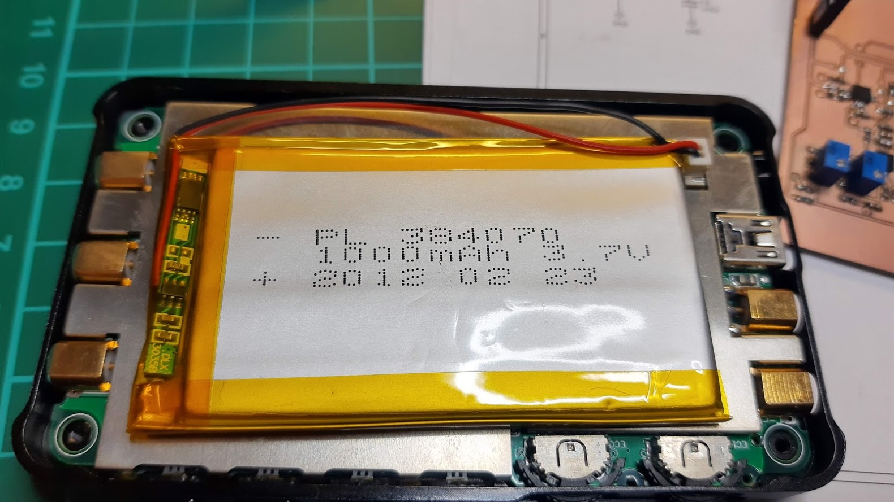
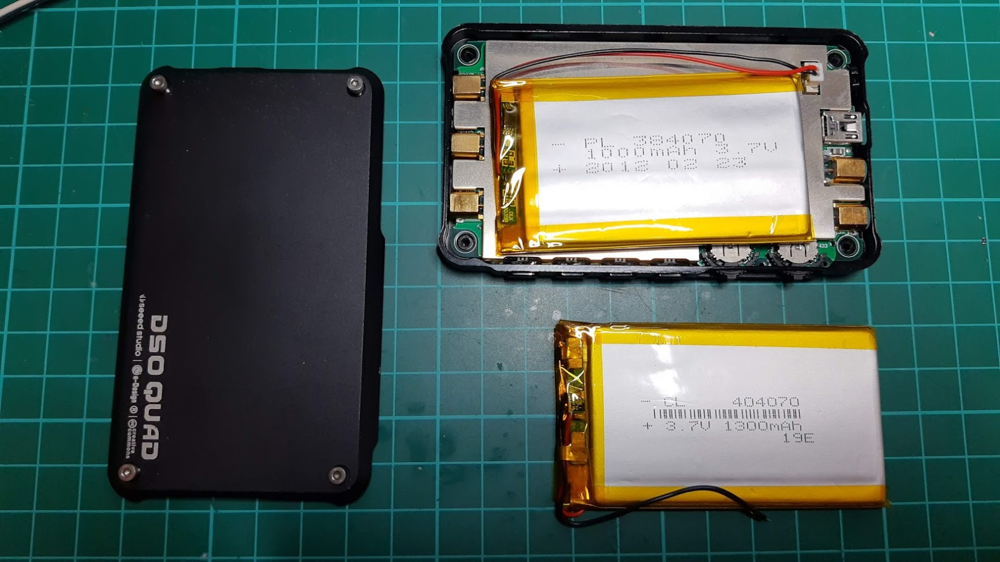
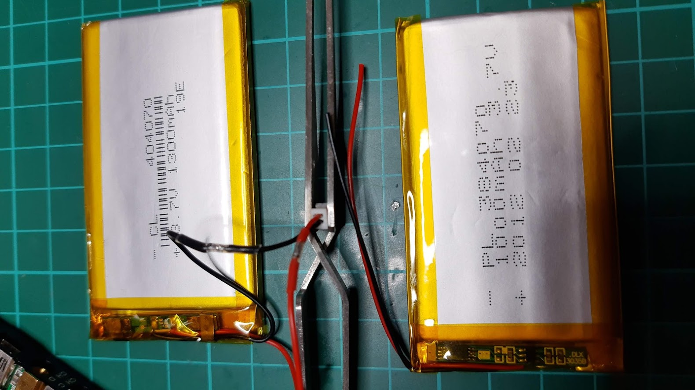
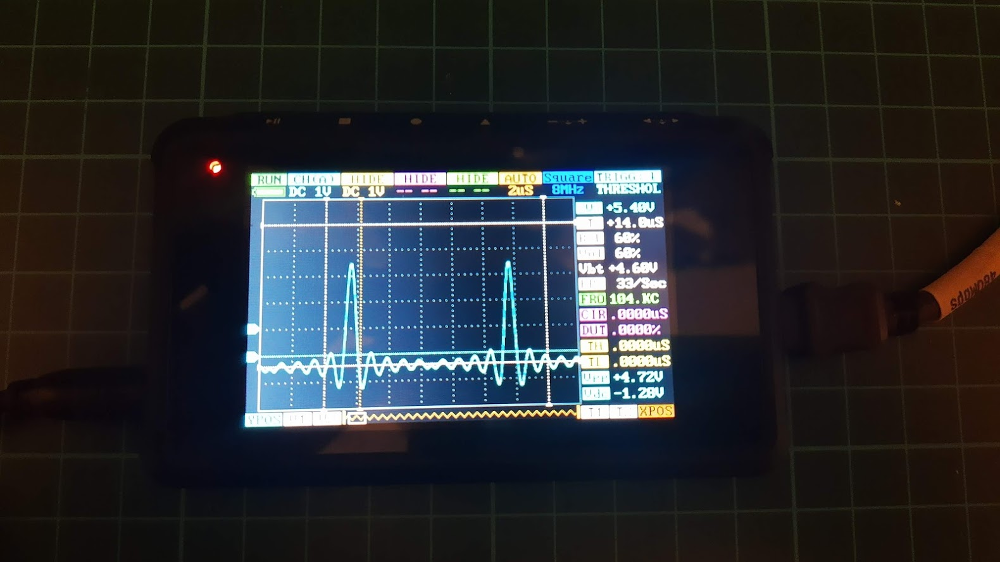

If you are happy user of DSO QUAD pocket oscilloscope then probably after all those years you need to replace the accumulator. Because stock model PL384070 3.7V 1000mAh is not available anymore you can safely use CL404070 3.7V 1300mAh that is only 0.2mm thicker but it also fits the scope very well and you gain 30% capacity. You only have to solder the plug from the old accumulator. Enjoy :-)

[1] https://www.seeedstudio.com/DSO-Quad-Aluminium-Alloy-Black-p-1034.html
